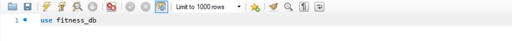
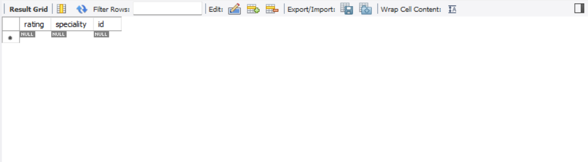
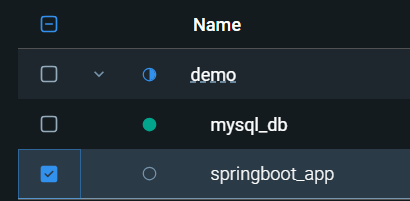
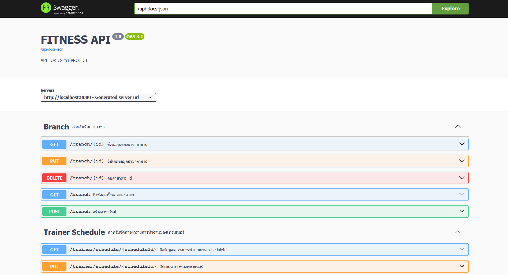

# Fitness API

## How to install
### สิ่งที่ต้องมี
- DBMs Tool ตัวไหนก็ได้ (แต่ในตัวอย่างนี้จะสอนแค่ MySQL Workbench)


### Build project
1. เปิด docker desktop ไว้
2. รัน ``git https://github.com/kamonphankanthayod/cs251-projrctGroup-frontend`` ใน terminal
3. เข้าไปยัง folder ที่ clone มา ``cd path/to/your/project``
4. Make sure ว่าอยู่ระดับเดียวดับไฟล์ ``docker-compose.yaml``
5. รัน ``docker-composer up --build`` ใน terminal
```bash
git clone https://github.com/kamonphankanthayod/cs251-projrctGroup-frontend
cd path/to/your/project
docker-compose up --build
```


## How to access database
ดาวโหลด MySQL workbench และ MySQL Server(หรือ DBMs ตัวไหนก็ได้แต่อันตัวอย่างนี้จะสอนแค่ mysql workbench) 

- เปิด MySQL Workbench ขึ้นมา
- คลิกเครื่องหมาย "+" ข้างMysql Connections แล้ว set ตามนี้
- Connection Name : Docker_Database
- HostName : 127.0.0.1 หรือ localhost
- Username : root
- password : คลิก Store in Vault พิมพ์ root คลิก ok
- คลิก Test connection
- ถ้าทุกอย่างถูกต้องจะขึ้น successfully made the connect
- กด ok
- กด ok
- คลิกเข้าไปที่ Docker_Database
- เขียน query ตามนี้ ```use fitness_db;```
- 
- กด Icon 

- ลองพิมพ์ query ```select * from trainer;```
- ถ้าได้ตารางเปล่าตามนีถือว่าทุกอย่างถูกต้องแล้ว



## Document

1. เปิด Docker Desktop ขึ้นมา
2. รัน springboot container ขึ้นมา



3. Copy path url นี้ไปใส่ใน browser ``http://localhost:8080/api-docs-ui``
4. ถ้าทุกอย่างถูกต้องจะต้องได้เว็บหน้าตาแบบนี้




## แก้ปัญหา ``Ports are not available:`` error
ถ้า build docker แล้วเจอ Error ประมาณนี้

```
Error response from daemon: Ports are not available: exposing port TCP 0.0.0.0:3306 -> 0.0.0.0:0: listen tcp 0.0.0.0:3306: bind: Only one usage of each socket address (protocol/network address/port) is normally permitted.
```

ให้ทําตามขั้นตอนดังนี้

### สําหรับ Window
1. กดปุ่ม ``Window + R``
2. พิมพ์ ``services.msc``
3. เลื่อนหาคําว่า ``MySQL80``
4. คลิกขวาที่ ``MySQL80`` จากนั้นเลือก ``stop``
5. รัน project อีกรอบ

### สําหรับ Linux
1. รันคําสั่ง ```sudo systemctl stop mysql``` หรือ ``sudo systemctl stop mysqld`` (ขึ้นอยู่กับ version ที่ติดตั้ง)
2. ตรวจสอบสถานะว่า MySQL หยุดแล้วหรือยัง ``sudo systemctl status mysql``
3. รัน project อีกรอบ


## เข้าเว็บ
1. เปิดเว็บเบราว์เซอร์
2. วาง``http://localhost:3000/login.html``
```bash
http://localhost:3000/login.html
```

### ก่อนทดสอบระบบควรมีข้อมูลใน data base ดังนี้ 
***คือควรมีใน data base
```bash
membership
	10001	Everything in Basic+Group fitness classes+Nutrition consultation+Access to all locations	1	Gold	70   ***
	10002	Access to gym floor+Basic equipment usage+Locker room access+Free water station	1	Basic	50   ***
	10003	Everything in Gold+Premium locker with amenities+Spa & recovery services+Priority class  	1	Platinum	100   ***
	10004	Access to fitness services+24/7Free personal locker	1	Standard	0    ***


promotion
	0	0	Percentage	0	2100-12-31	2020-01-01	Active     ***
	20001	DISCOUNT10	Percentage	10	2026-01-31	2025-01-01	Active
	20002	SAVE25	Fixed Amount	25	2026-02-28	2025-02-01	Active
	20003	NEWYEAR50	Percentage	50	2026-01-05	2024-12-25	Active
	20004	DISCOUNT20	Percentage	20	2026-01-31	2025-01-25	Active
```


# ตัว github ที่ใช้ในการพัฒนา
```bash
https://github.com/kamonphankanthayod/cs251-projrctGroup-frontend
https://github.com/Nattasak-Chonmanat/fitness_backend_cs251.git
```